# Budget Tracker App - Data Flow Diagrams

## 1. Overall System Data Flow

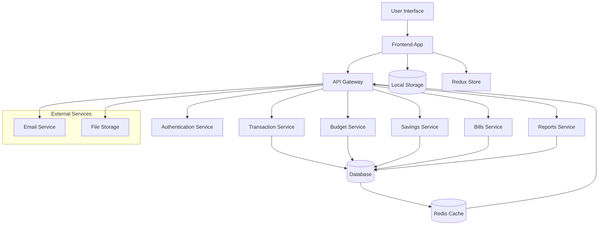

## 2. User Authentication Flow

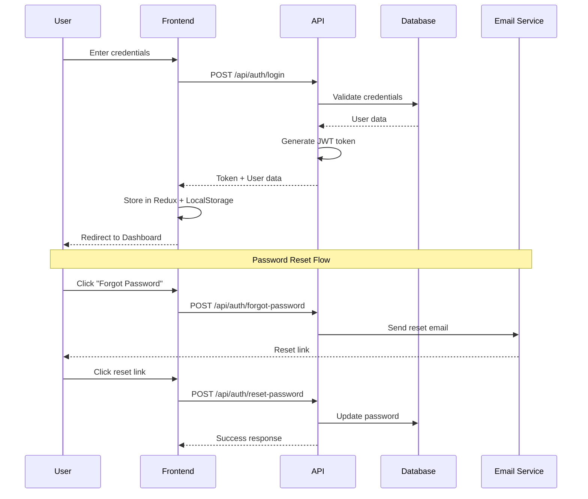

## 3. Transaction Creation Flow

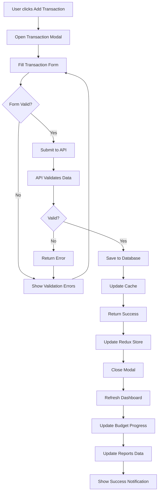

## 4. Budget Calculation Flow

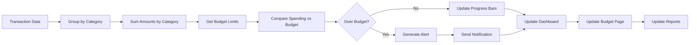

## 5. Dashboard Data Aggregation Flow

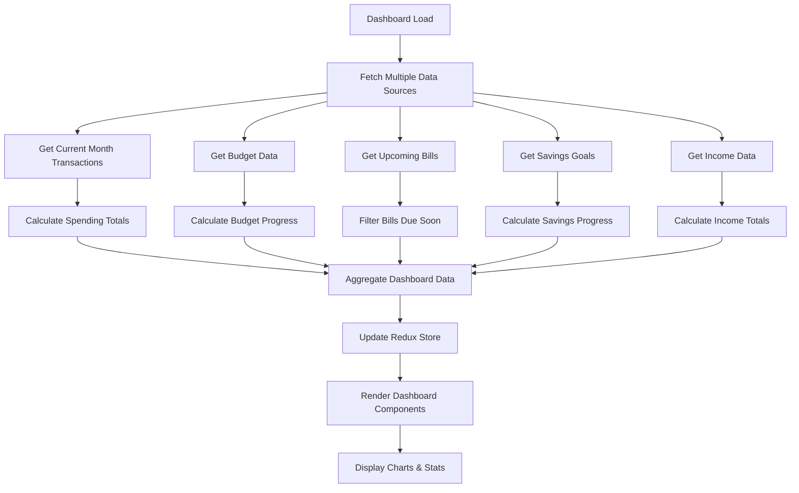

## 6. Report Generation Flow

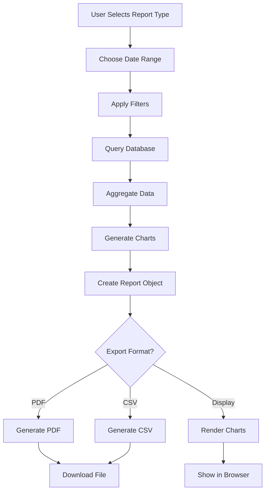

## 7. Real-time Updates Flow

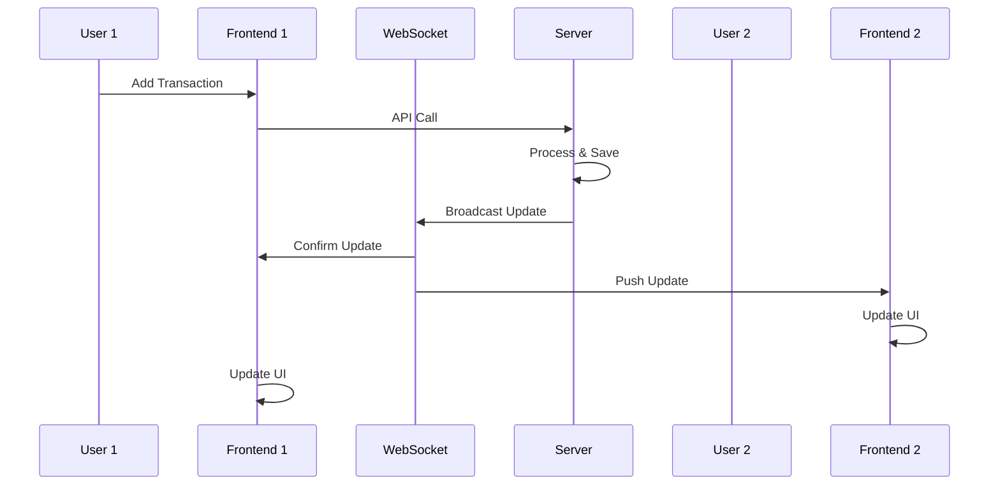

## 8. Data Synchronization Flow

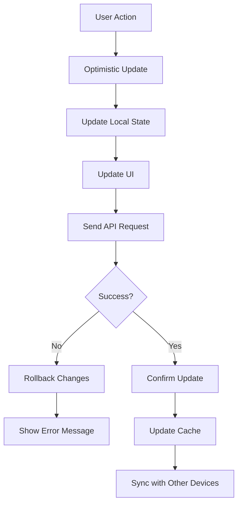

## 9. Bill Payment Flow

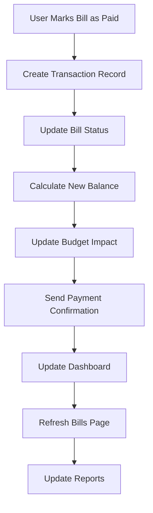

## 10. Savings Goal Progress Flow

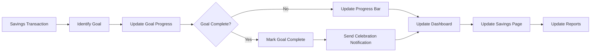

## 11. Error Handling Flow

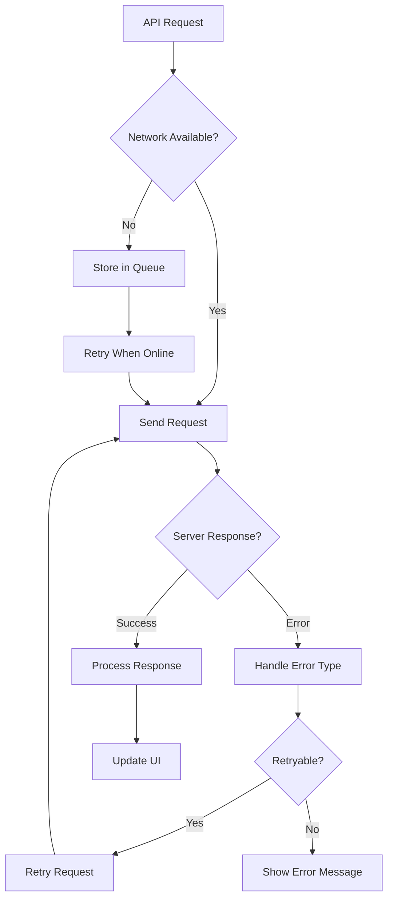

## 12. Data Export Flow

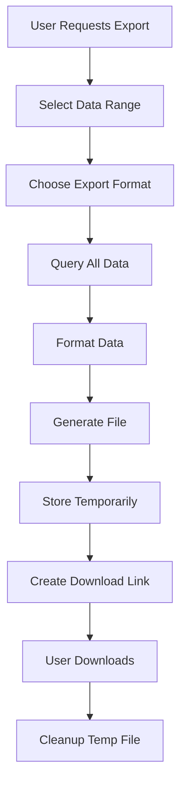

## Data Flow Summary

### Key Data Flows:
1. **User Input** → **Validation** → **API** → **Database** → **Cache** → **UI Update**
2. **Real-time Updates** via WebSocket connections
3. **Optimistic Updates** for better user experience
4. **Error Handling** with retry mechanisms
5. **Data Synchronization** across multiple devices
6. **Export/Import** functionality for data portability

### Critical Integration Points:
- **Transactions** are the central data source affecting all other modules
- **Dashboard** aggregates data from all modules for overview
- **Budget** calculations depend on transaction categorization
- **Reports** consume data from all modules for analysis
- **Settings** affect all modules through preferences and categories
