# Budget Tracker App - Flowcharts

## 1. Application Entry Flow

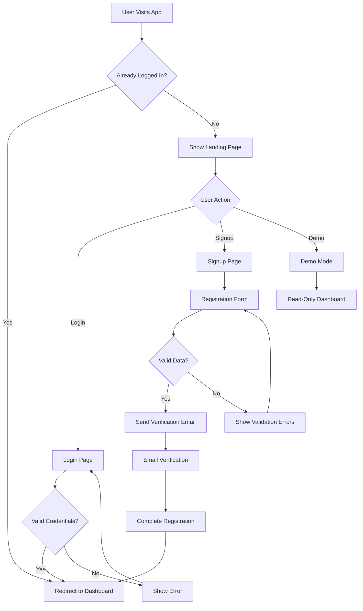

## 2. Dashboard Navigation Flow

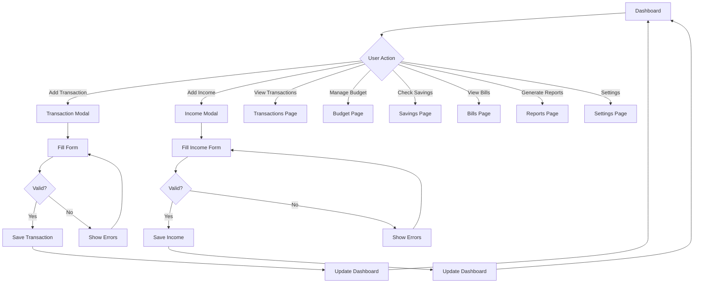

## 3. Transaction Management Flow

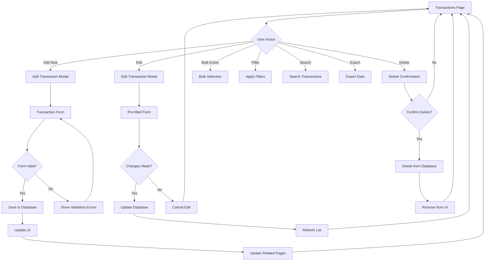

## 4. Budget Management Flow

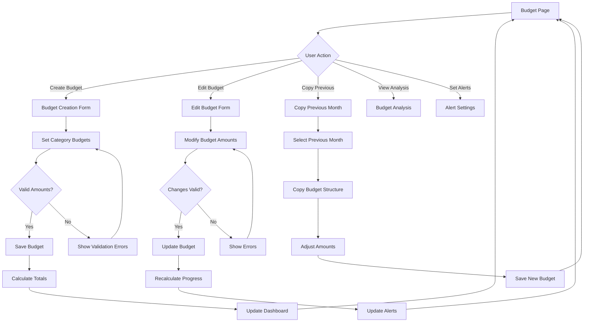

## 5. Savings Goal Flow

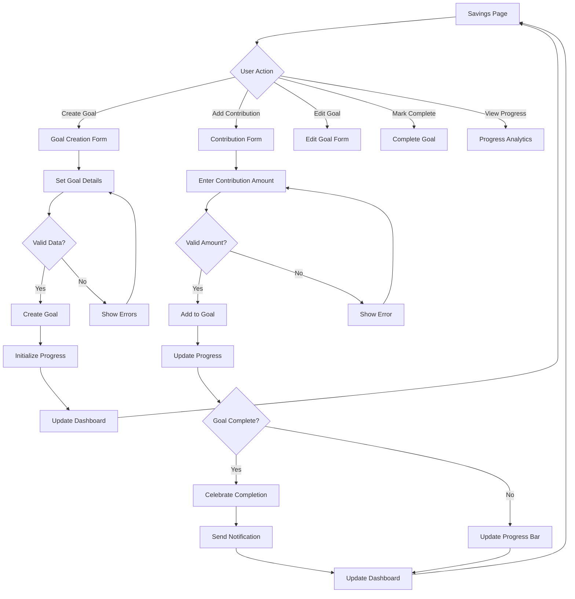

## 6. Bill Management Flow

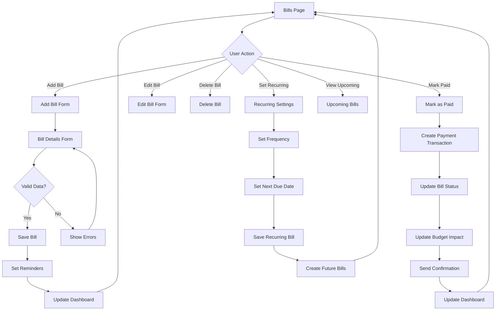

## 7. Report Generation Flow

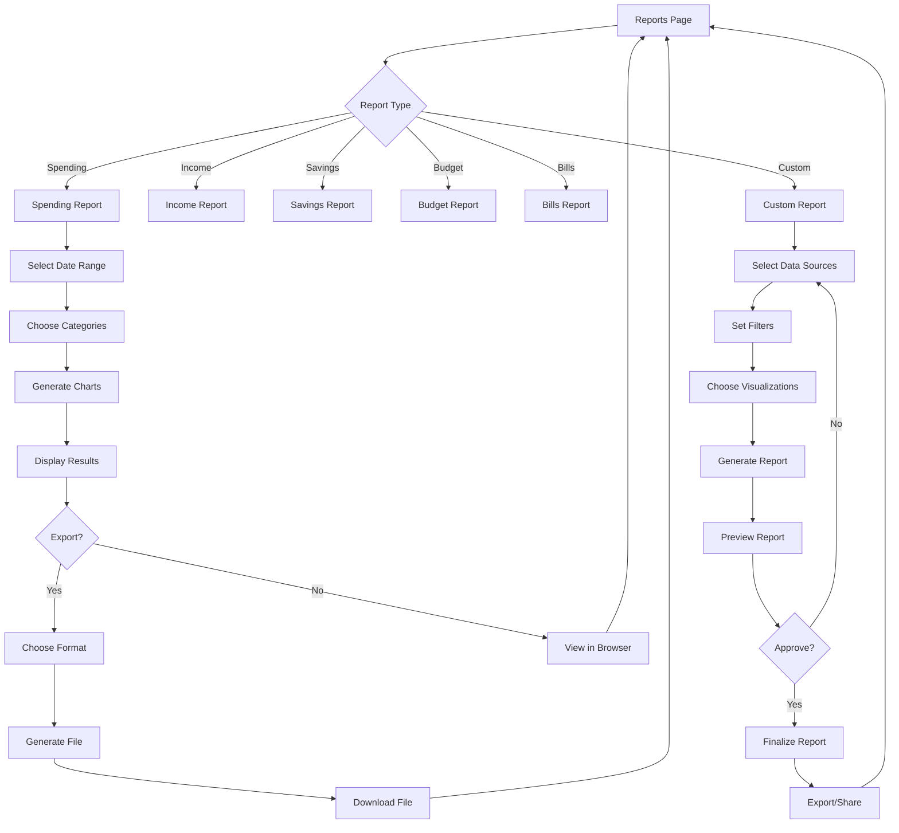

## 8. Settings Management Flow

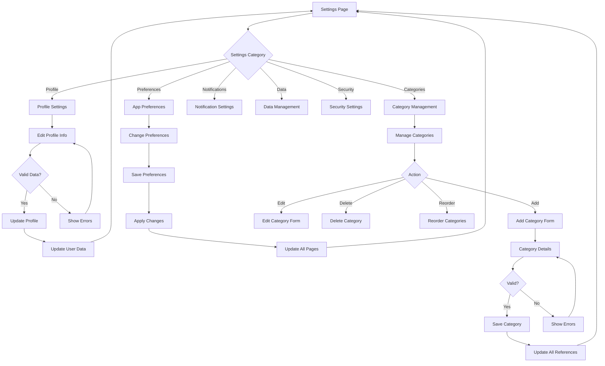

## 9. Error Handling Flow

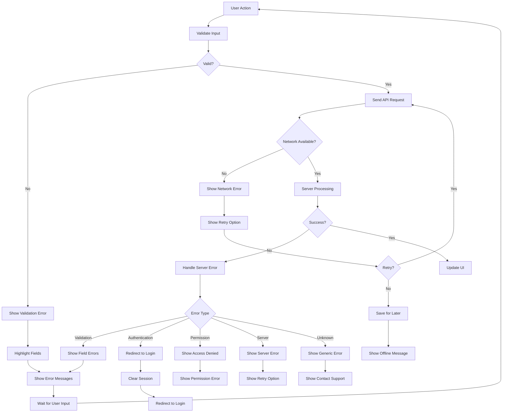

## 10. Data Synchronization Flow

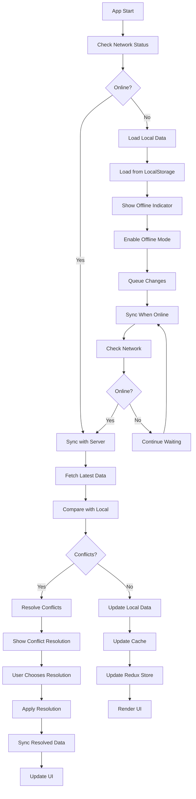

## 11. Mobile Navigation Flow

```mermaid
flowchart TD
    A[Mobile App Start] --> B[Bottom Navigation]
    B --> C{Selected Tab}
    C -->|Dashboard| D[Dashboard View]
    C -->|Transactions| E[Transactions List]
    C -->|Budget| F[Budget Overview]
    C -->|Savings| G[Savings Goals]
    C -->|More| H[Hamburger Menu]
    
    D --> I[Quick Actions]
    I --> J[Floating Action Button]
    J --> K[Add Transaction Modal]
    K --> L[Form Input]
    L --> M[Save & Close]
    M --> D
    
    E --> N[Transaction List]
    N --> O[Swipe Actions]
    O --> P{Action Type}
    P -->|Edit| Q[Edit Modal]
    P -->|Delete| R[Delete Confirmation]
    P -->|Duplicate| S[Duplicate Transaction]
    
    H --> T[Menu Options]
    T --> U{Menu Item}
    U -->|Reports| V[Reports Page]
    U -->|Bills| W[Bills Page]
    U -->|Income| X[Income Page]
    U -->|Settings| Y[Settings Page]
    U -->|Logout| Z[Logout Confirmation]
```

## 12. Search and Filter Flow

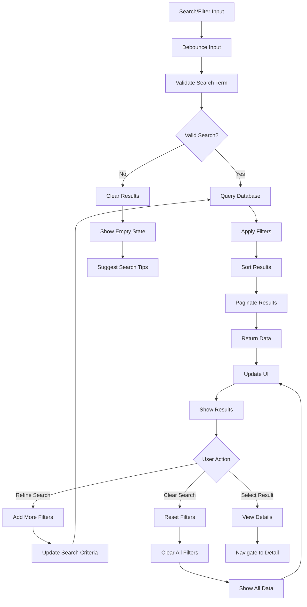

## Flowchart Summary

### Key Decision Points:
1. **Authentication**: Login state determines app access
2. **Form Validation**: All inputs validated before processing
3. **Network Status**: Online/offline mode handling
4. **Error Handling**: Multiple error types with specific responses
5. **User Actions**: Each action triggers specific workflows
6. **Data Sync**: Conflict resolution and offline support

### Critical Paths:
- **Transaction Entry**: Most frequent user action
- **Dashboard Updates**: Real-time data aggregation
- **Error Recovery**: Graceful handling of failures
- **Mobile Navigation**: Touch-optimized interactions
- **Data Persistence**: Reliable save and sync operations
